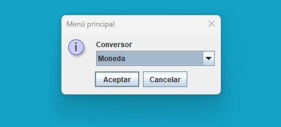

# Conversor Project

  

## Overview

The Conversor Project is a versatile converter application built using Java and the Swing library. It provides a user-friendly graphical interface for performing unit conversions. The project follows the principles of Object-Oriented Programming (OOP) to create a modular and extensible design.

***

## Built with

- Java
- Swing library

***

## Features

- **User Interface:** The project utilizes the Java Swing library to create a graphical user interface (GUI) that enhances the user experience. It includes menus, input dialogs, and output displays for seamless interaction.

- **Modular Architecture:** The project follows an Object-Oriented Programming (OOP) approach, allowing for modular design and encapsulation of functionality. Different classes handle specific conversion types, making the application easily extensible.

- **Customization:** Users can create new converters by extending the base `Conversor` class and implementing the required conversion logic for specific unit types. This customization feature enables the addition of converters for various units, such as speed, weight, temperature, and more.

- **Conversion Process:** The conversor provides a menu where users can select the desired conversion type. After selecting the conversion type, users are prompted to enter the required values for conversion. The input values are validated and processed according to the implemented conversion logic, and the converted value is displayed to the user.

- **Modifiability:** The project's OOP design allows for easy modification of existing converters. Users can extend the functionality or adjust the conversion formulas without affecting the overall application structure. This modifiability feature ensures flexibility and adaptability to different conversion needs.

***

## Author 

- `Santiago Rodriguez Morales` - [@SanRM](https://github.com/SanRM)

 
